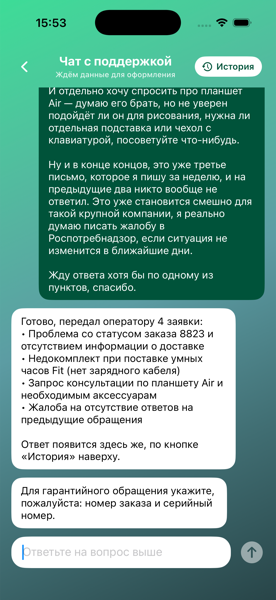
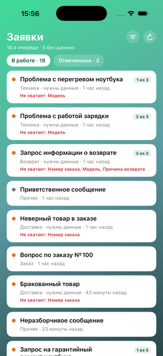
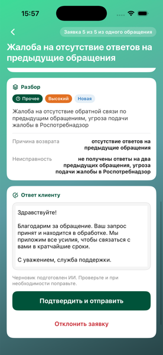
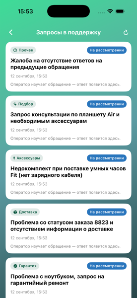

# Support Triage — ИИ-помощник поддержки магазина техники

iOS-приложение и FastAPI-бэкенд. Клиент пишет обращение свободным текстом, система разбирает его на отдельные заявки, сама добирает недостающие данные в чате и отдаёт оператору только то, с чем уже можно работать.

MISIS Short Hack, 6 часов.

---

## Задача

Оператор первой линии разбирает десятки писем и расшифровок звонков в день. Каждое надо прочитать, понять, разложить на задачи и выяснить, каких данных не хватает.

Два случая, которые съедают время:

1. **Одно сообщение — несколько проблем.** «Ноутбук греется, заказ не приехал, и поддержка не отвечает» — это три разные заявки с разными приоритетами и маршрутом.
2. **Неполная информация.** Клиент почти никогда не указывает серийный номер, дату покупки или номер заказа. Без них гарантийную заявку принять нельзя.

## Принцип

> LLM отвечает за понимание текста. Решения принимает обычный код.

| LLM | Код |
|---|---|
| разбить сообщение на отдельные проблемы | каких полей не хватает (сверка со схемой) |
| определить категорию из фиксированного списка | какой статус у заявки |
| вытащить сущности: модель, номер заказа, дату | приоритет и маршрутизация |
| написать черновик ответа | что спросить у клиента, когда отдать оператору |

Одно и то же обращение всегда обрабатывается одинаково, а любое решение системы можно объяснить и починить за пять минут. Если бы действия выбирала модель, на демо было бы случайное поведение без возможности отладки.

---

## Как это выглядит

| Клиент пишет одно сообщение | Оператор видит очередь |
|---|---|
|  |  |
| Три заявки из одного текста. По гарантии не хватает данных — система спрашивает их одним сообщением, а не тремя письмами подряд. | Сначала старые. Бейдж «1 из 3» показывает, что заявки пришли из одного обращения. Красным — чего не хватает. |

| Карточка заявки | Клиент видит статусы |
|---|---|
|  |  |
| Исходный текст, разбор, извлечённые поля и **готовый черновик ответа** — оператор правит и подтверждает. | «Нужны данные», «На рассмотрении», «Отвечено» — вместе с ответом оператора. |

---

## Поток

```
Клиент пишет                 LLM разбивает        Код проверяет
«ноутбук греется,     ──►    на 3 заявки    ──►   обязательные поля
заказ 8823 не пришёл,                             по категории
поддержка молчит»
                                                        │
                     ┌──────────────────────────────────┴───────────┐
                     ▼                                              ▼
            данных достаточно                            чего-то не хватает
                     │                                              │
                     ▼                                              ▼
            статус new, заявка                       статус collecting, заявка
            уходит оператору                         остаётся в чате клиента
                     │                                              │
                     ▼                                     один вопрос по всем
            черновик ответа,                            пробелам сразу; ответ
            оператор правит                             клиента дозаполняет
            и подтверждает                              поля → уходит оператору
```

Ключевое: **неполная заявка к оператору не попадает.** Лента оператора исключает статус `collecting`. Оператор получает только то, с чем можно работать.

Если клиент не может найти серийный номер, после двух безрезультатных ответов в чате появляется кнопка «передать оператору как есть» — тупика нет.

---

## Что внутри

**Бэкенд** — FastAPI + SQLite + Yandex AI Studio (Alice AI LLM, Structured Outputs).

```
backend_v1/app/
├── api/routes/     issues.py · auth.py · views.py
├── core/
│   ├── triage.py   REQUIRED, missing, статус, текст уточнения — все правила здесь
│   ├── security.py PBKDF2-хеширование паролей
│   └── seed.py     аккаунт оператора
├── models/         issues · users · product_views
├── schemas/        Pydantic-контракты HTTP и LLM
└── services/
    ├── llm.py      вызовы Yandex AI Studio
    └── fake_llm.py офлайн-заглушка модели
```

**iOS** — SwiftUI, async/await.

```
Sber/
├── Authorization/  роли, вход, регистрация, AuthStore
├── Chat/           чат, диктовка (SFSpeechRecognizer)
├── Client/         каталог, история просмотров, история запросов
├── Goods/          витрина и карточка товара
├── Networking/     APIClient, MockBackend (офлайн-режим)
└── Operator/       очередь заявок и карточка заявки
```

Приложение не ходит в LLM напрямую: промпт правится десятки раз за хакатон, ключ не уезжает в клиент, а iOS и бэкенд делаются параллельно.

## Возможности

- Разбор одного сообщения на несколько заявок со связью между ними
- Определение недостающих полей по категории и сбор их в диалоге
- Категории, приоритеты и статусы из закрытых списков — фильтры не разъезжаются
- `critical` только при риске безопасности: возгорание, дым, искрение, вздувшийся аккумулятор
- Черновик ответа готовится сам, оператор его правит и подтверждает
- Голосовое обращение — распознавание на устройстве, текст правится перед отправкой
- Авторизация с хешированием паролей, история просмотров у каждого клиента своя
- Офлайн-режим: приложение работает без бэкенда с теми же правилами триажа

---

## Запуск

### Бэкенд

```bash
cd backend_v1
python3 -m venv .venv && source .venv/bin/activate
pip install -r requirements.txt
cp .env.example .env        # заполнить YANDEX_API_KEY и YANDEX_CLOUD_FOLDER
uvicorn app.main:app --reload
```

API на `http://127.0.0.1:8000`, документация на `/docs`. База создаётся сама.

Без ключа Yandex — с заглушкой модели, флоу работает целиком:

```bash
USE_FAKE_LLM=1 uvicorn app.main:app --reload
```

### iOS

Открыть `Sber.xcodeproj`, собрать на симуляторе — `localhost` работает без настройки.

Оператор: `operator` / `12345`. Клиента нужно зарегистрировать, аккаунт сохранится в базе.

<details>
<summary>Запуск на реальном телефоне</summary>

Три условия, каждое ломается молча:

1. В `Sber/Networking/API.swift` заменить `base` на адрес мака — `ipconfig getifaddr en0`.
2. Запустить бэкенд как `uvicorn app.main:app --host 0.0.0.0`. По умолчанию он слушает только `127.0.0.1` и отказывает всем извне.
3. Телефон и мак в одном Wi-Fi, **не гостевом**: сети вузов часто изолируют устройства друг от друга.

Первый запрос попросит разрешение на доступ к локальной сети.
</details>

---

## API

| Метод | Путь | Назначение |
|---|---|---|
| `POST` | `/analyze` | Разбор сообщения на заявки, уточнение по всем пробелам сразу |
| `POST` | `/requests/{id}/clarify` | Ответ клиента дозаполняет поля и отправляет заявку оператору |
| `GET` | `/issues` | Очередь оператора (без `collecting`) |
| `GET` | `/users/{id}/issues` | Заявки клиента |
| `PATCH` | `/issues/{id}` | Правка полей, статуса и слотов с пересчётом `missing` |
| `POST` | `/issues/{id}/generate-reply` | Черновик ответа |
| `POST` | `/issues/{id}/reply` | Финальный ответ оператора |
| `POST` | `/auth/register`, `/auth/login` | Аккаунты, пароль хранится хешем |
| `GET/POST/DELETE` | `/users/{id}/views` | История просмотров клиента |

Подробные примеры запросов и ответов — в [backend_v1/README.md](backend_v1/README.md).

**Категории:** `technical`, `delivery`, `payment`, `return`, `warranty`, `accessories`, `product_advice`, `account_order`, `other`
**Приоритеты:** `critical`, `high`, `medium`, `low`
**Статусы:** `collecting`, `new`, `awaiting_info`, `in_progress`, `resolved`, `closed`

---

## Ограничения

Осознанные решения, а не недоделки:

- **Человек подтверждает каждый ответ.** Модель может пообещать возврат, которого не будет. Автоматически клиенту уходят только уточняющие вопросы — они ничего не обещают.
- **Закрытый список категорий.** Меньше гибкости, зато «возврат», «оформление возврата» и «возвраты» не станут тремя разными группами.
- **Авторизация без сессий.** Пароли хешируются и лежат в БД, роль проверяется при входе, но токенов нет и эндпоинты заявок не закрыты.
- **`allow_origins=["*"]`** — для локальной разработки.
- **Серийный номер лучше набирать, а не диктовать.** Распознавание речи превращает `SN-4481-XZ` в «эс эн 44 81», поэтому распознанный текст всегда показывается клиенту до отправки: выдуманное значение в поле хуже пустого.

## Что дальше

- Дозаполнение полей из фото чека — серийный номер с фотографии распознаётся надёжнее, чем с голоса
- Оценка уверенности модели и автоэскалация при низкой
- Подсветка фрагмента исходного текста, из которого получена заявка
- Метрика точности категоризации на размеченном наборе обращений
